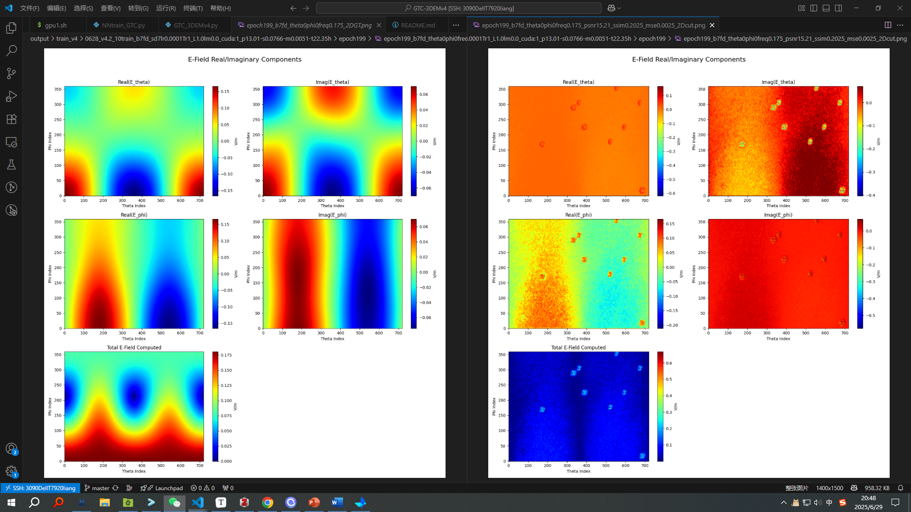
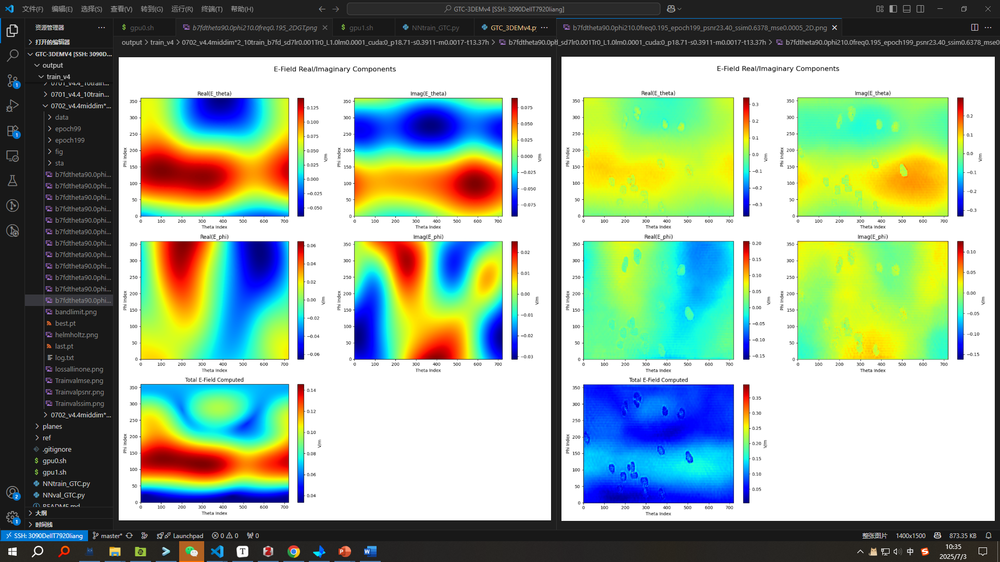

# v4
2025年6月24日09:02:05 计划实现复电场预测，复数网络，重点是PINN loss和新的物理指标。
PINN loss:
helmholtz loss
fft bandlimit loss
reciprocity loss
total E frequency consistency partial diffrencial loss
real-imaginary hilbert transform loss
本征模感应电场？

2025年6月24日21:17:37 4维复电场预测，网络输出从1改为4维，已跑通，差作图，计划做四张图+一张abs(E)这样子
2025年6月26日15:16:15 完成作图，确定AmPhase / RealImage的数据处理，且转化为总场的计算公式分别为：
 - AmPhase为6维     Abs(E )[V/m] Abs(Theta)[V/m] Phase(Theta)[deg.] Abs(Phi )[V/m] Phase(Phi )[deg.] Ax.Ratio[ ]
 ```
delta_phi_rad = (E_phase_theta - E_phase_phi) * (torch.pi / 180.0)
E_abs_theta_sq = E_abs_theta**2 #预计算振幅的平方
E_abs_phi_sq = E_abs_phi**2
term1 = E_abs_theta_sq + E_abs_phi_sq #应用计算椭圆长半轴(A_maj)的精确公式: A_maj^2 = 0.5 * [|Eθ|²+|Eφ|² + sqrt( (|Eθ|²-|Eφ|²)² + 4|Eθ|²|Eφ|²cos²(Δφ) )]
term2_inner_sqrt = torch.sqrt((E_abs_theta_sq - E_abs_phi_sq)**2 + 4 * E_abs_theta_sq * E_abs_phi_sq * (torch.cos(delta_phi_rad))**2)
E_total_abs_sq = 0.5 * (term1 + term2_inner_sqrt)
E_total_abs_compute = torch.sqrt(E_total_abs_sq) # 开方得到最终的总场强（椭圆长半轴）
 ```
 - RealImage为4维   Real(E_theta)[V/m] Imag(E_theta)[V/m] Real(E_phi)[V/m] Imag(E_phi)[V/m]
 ```
E_abs_theta = torch.sqrt(E_theta_real**2 + E_theta_imagine**2)
E_abs_phi = torch.sqrt(E_phi_real**2 + E_phi_imagine**2)
E_phase_theta_rad = torch.atan2(E_theta_imagine, E_theta_real)
E_phase_phi_rad = torch.atan2(E_phi_imagine, E_phi_real)
delta_phi_rad = E_phase_theta_rad - E_phase_phi_rad
E_abs_theta_sq = E_abs_theta**2
E_abs_phi_sq = E_abs_phi**2
term1 = E_abs_theta_sq + E_abs_phi_sq
term2_inner_sqrt = torch.sqrt((E_abs_theta_sq - E_abs_phi_sq)**2 + 4 * E_abs_theta_sq * E_abs_phi_sq * (torch.cos(delta_phi_rad))**2)
E_total_abs_sq = 0.5 * (term1 + term2_inner_sqrt)
E_total_abs_compute = torch.sqrt(E_total_abs_sq)
 ```

## v4.0
2025年6月26日16:31:46 成功跑通 开始训练原生GTC-3DEMv4.0 无复数网络 无PINNloss 无任何先验
效果不好，学不到东西，不知为何

## v4.1
2025年6月27日20:48:40 加了一堆乱七八糟的，但是还未全验证，分为指标/loss，具体有加权L1 maxminloss，和helmholtz bandlimit kramers_kronig_consistency frequency_smoothness；
实验思想是一个一个加，先把指标全用上，然后loss一个一个加。部分接口已经预留好了，先从加权L1开始
2025年6月28日10:24:01 加权L1无效 看看maxminloss

## v4.2
2025年6月29日10:17:56 四个输出头
还是没啥用 groups=4也没啥用 但是Tr=1有点用，能看出在努力学，但是拟合的很差，且仍是同一个模式，只不过有±差异


## v4.3
2025年6月29日21:18:48 复数网络！开大招了。看看效果。
2025年6月30日10:40:58 怎么也没啥用啊。。还是四个维度学不出差异来，难道是监督的问题？

## v4.4
2025年6月30日15:43:50 尝试用两个decoder，分别预测复$E_{θ}$ 复$E_{φ}$
2025年7月2日15:50:25 还是没货。Tr1有点效果，看来就是难度变大了。先看看先用一个复网络只预测一个复数行不行不要一下就4维，然后再试试两个头分别加个线性层可能会有用，然后再试试更合理的conditioning

2025年7月3日10:35:02 预测一个复数也不行 看着区分不开 是不是conditioning？ 我草我草但是加大参数量就有用了 Tr0也可以。问题是还是有肿瘤，是不是也是conditioning的问题。试试看不要conditioning能不能学好 有没有肿瘤

